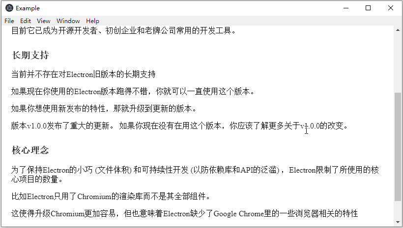
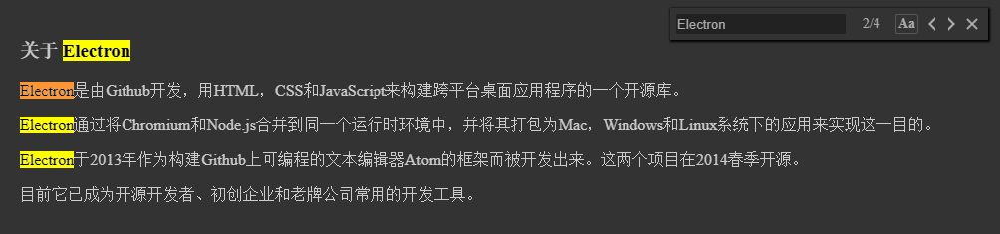

# electron-find

简体中文 | [English](./README.md)

## 简介
在Electron app页内查找匹配关键字的所有文本字符

## 特征
- 依赖于Electron的findInPage API
- 支持使用者灵活配置UI界面
- 支持区分大小写
- 当用户输入时自动查找
- 查找输入框文本隔离，不会被匹配到
- 支持以下Electron版本 ^1.8.7, ^2.0.0, ^3.0.0, ^4.0.0
- 支持以下平台 Windows, Linux, Mac

## 演示

### 默认UI


### 定制化UI


## 安装
``` 
$   npm install electron-find --save
```

## 使用
```
# 引入模块
import { remote, ipcRenderer } from 'electron'
import { FindInPage } from 'electron-find'

# 使用默认配置来创建实例
let findInPage = new FindInPage(remote.getCurrentWebContents())
findInPage.openFindWindow()

# 开启预加载选项，创建实例的时候会同时加载查找窗口相关dom
let findInPage = new FindInPage(remote.getCurrentWebContents(), {
  preload: true
})
findInPage.openFindWindow()

# 配置父节点元素, 默认为 document.body
let findInPage = new FindInPage(remote.getCurrentWebContents(), {
  parentElement: document.querySelector('#id')
})
findInPage.openFindWindow()

# 配置查找窗口显示或隐藏的过渡周期, 默认为 300 (ms)
let findInPage = new FindInPage(remote.getCurrentWebContents(), {
  duration: 200
})
findInPage.openFindWindow()

# 配置查找窗口相对于父级定位节点的偏移量
let findInPage = new FindInPage(remote.getCurrentWebContents(), {
  offsetTop: 20,
  offsetRight: 30
})
findInPage.openFindWindow()

# 自定义UI界面颜色
let findInPage = new FindInPage(remote.getCurrentWebContents(), {
  boxBgColor: '#333',
  boxShadowColor: '#000',
  inputColor: '#aaa',
  inputBgColor: '#222',
  inputFocusColor: '#555',
  textColor: '#aaa',
  textHoverBgColor: '#555',
  caseSelectedColor: '#555'
})
findInPage.openFindWindow()

# 参考demo
npm install
npm run e
```
## 快捷键
| 键   |   功能  |
| ------ | ------      | 
| Enter  | 查找上一个   | 
| Shift + Enter| 查找下一个 |
| Esc    | 关闭窗口 | 

 另外, 可以参考demo，使用全局快捷键来打开窗口。

 ## API
 ### Class: FindInPage
 ` new FindInPage(webContents, [options]) `
- ` webContents ` Object(required) - 渲染进程的webContents对象
- ` options ` Object(optional)
   - ` preload ` Boolean - 创建实例的时候是否预加载查找窗口。 默认为 `false`。
   - ` parentElement ` Object - 指定查找窗口的父级节点。 默认为 `document.body`。
   - ` duration ` Number - 指定查找窗口显示或隐藏的过渡周期。 默认为 `300` (ms)。
   - ` offsetTop ` Number - 指定查找窗口相对于父级定位元素顶部偏移量。 默认为 `5`。
   - ` offsetRight ` Number - 指定查找窗口相对于父级定位元素右边偏移量。 默认为 `5`。
   - ` boxBgColor ` String - 配置查找窗口背景色。 默认为 `"#ffffff"`。
   - ` boxShadowColor ` String - 配置查找窗口阴影色。 默认为 `"#909399"`。
   - ` inputColor ` String - 配置输入框文本颜色。 默认为 "#606266"。
   - ` inputBgColor ` String - 配置输入框背景颜色。 默认为 `"#f0f0f0"`。
   - ` inputFocusColor ` String - 配置输入框聚焦时的边框颜色。 默认为 `"#c5ade0"`。
   - ` textColor ` String - 配置查找窗口中文本颜色。 默认为 `"#606266"`。
   - ` textHoverBgColor ` String - 配置鼠标悬停文本时的背景色。 默认为 `"#eaeaea"`。
   - ` caseSelectedColor ` String - 配置区分大小写选项选中时的边框颜色。 默认为 `"#c5ade0"`。

 ### Instance Methods
 使用new FindInPage 创建的实例具有以下方法:      
 &nbsp;  
  ` findInPage.openFindWindow() `  
 当查找窗口关闭时，打开窗口。 当查找窗口已经打开时，聚焦输入框。  
 &nbsp;   
  ` findInPage.closeFindWindow() `  
 关闭窗口。    
 &nbsp;   
  ` findInPage.destroy() `  
 关闭窗口，清除对象的引用，释放内存。


